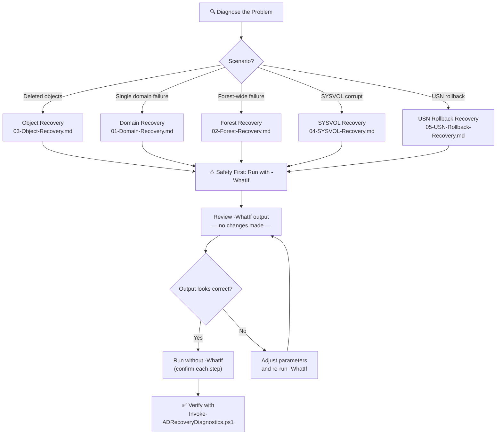

# Active Directory Recovery Documentation


> **Author:** Jan Tiedemann | **Version:** 1.0.0 | **Last Updated:** 2026-03-24 | **Initial release:** not published 2012-04-12
>
> **Applies to:** Windows Server 2025, Windows Server 2022, Windows Server 2019, Windows Server 2016

This repository contains step-by-step recovery procedures for various Active Directory disaster scenarios. All documentation uses the **Contoso** sample environment and should be adapted to your specific topology before use.

## Sample Environment

| Property | Value |
|---|---|
| Forest Root Domain | `contoso.com` |
| Child Domain (example) | `corp.contoso.com` |
| Forest Functional Level | Windows Server 2016 (or higher) |
| Domain Functional Level | Windows Server 2016 (or higher) |
| Domain Controllers | Virtualized Windows Server 2016 / 2019 / 2022 / 2025 |
| Backup Method | Windows Server Backup (Full Server) |

## Recovery Workflow



## Safety First — `-WhatIf` Support

All scripts that modify Active Directory support PowerShell's built-in **`-WhatIf`** switch. This lets you preview every change before it is applied — nothing is modified until you explicitly confirm.

**Recommended workflow:**

1. **Dry run** — Execute any script with `-WhatIf` first:

   ```powershell
   .\Reset-KrbtgtPassword.ps1 -DomainFQDN "contoso.com" -WhatIf
   # Output: What if: Performing the operation "Reset password twice" on target "krbtgt@contoso.com".
   ```

2. **Review** — Verify the displayed actions match your intent.

3. **Execute** — Run the script without `-WhatIf`. Scripts with `ConfirmImpact = 'High'` will still prompt for confirmation unless you pass `-Confirm:$false`.

> **Note:** The two read-only diagnostic scripts (`Detect-USNRollback.ps1` and `Invoke-ADRecoveryDiagnostics.ps1`) do not require `-WhatIf` because they make no changes.

## Recovery Guides

| Guide | Scenario |
|---|---|
| [Domain Recovery](docs/01-Domain-Recovery.md) | Single domain failure — restore one DC, clean up metadata, rebuild remaining DCs |
| [Forest Recovery](docs/02-Forest-Recovery.md) | Forest-wide failure — restore forest root DC first, then child domain DCs |
| [Object Recovery](docs/03-Object-Recovery.md) | Recover accidentally deleted AD objects (users, groups, OUs) from the AD Recycle Bin or authoritative restore |
| [SYSVOL Authoritative Restore](docs/04-SYSVOL-Recovery.md) | Authoritative DFS-R SYSVOL synchronization when SYSVOL is corrupt or inconsistent |
| [USN Rollback Recovery](docs/05-USN-Rollback-Recovery.md) | Detect and recover from USN rollback caused by unsupported snapshot/image restores |

## Prerequisites

- [ ] Active Directory backup strategy in place (Windows Server Backup or equivalent)
- [ ] Windows Server installation media available
- [ ] Administrative credentials (Domain Admin / Enterprise Admin)
- [ ] Network isolation capability (ability to disconnect DCs from the network during restore)
- [ ] Documented list of all Domain Controllers, their roles (FSMO), and IP addresses

## PowerShell Scripts

> **Disclaimer:** These scripts are provided **as-is** with no warranty of any kind. They are intended as a starting point and **must be reviewed and tested in a non-production environment** before use in any real recovery scenario. The author assumes no liability for damages resulting from their use.

| Script | Description | Used In |
|---|---|---|
| [Reset-KrbtgtPassword.ps1](scripts/Reset-KrbtgtPassword.ps1) | Resets the krbtgt account password twice to invalidate all Kerberos tickets | Domain Recovery Step 3, Forest Recovery Step 2.3 / 3.3 |
| [Find-LinuxKerberosKeytabs.ps1](scripts/Find-LinuxKerberosKeytabs.ps1) | Discovers Linux/Unix systems using Kerberos keytabs that will be affected by a krbtgt reset | Domain Recovery Step 3 (pre-check), Forest Recovery Step 2.3 / 3.3 (pre-check) |
| [Find-AuthoritativeDC.ps1](scripts/Find-AuthoritativeDC.ps1) | Inspects all DCs and recommends the best authoritative SYSVOL source | SYSVOL Recovery Step 1 |
| [Set-AuthoritativeSYSVOLRestore.ps1](scripts/Set-AuthoritativeSYSVOLRestore.ps1) | Marks a DC as the authoritative SYSVOL source for DFS-R | Domain Recovery Step 4, Forest Recovery Step 2.4 / 3.4, SYSVOL Recovery Step 2 |
| [Set-NonAuthoritativeSYSVOL.ps1](scripts/Set-NonAuthoritativeSYSVOL.ps1) | Disables/re-enables DFS-R on all non-authoritative DCs | SYSVOL Recovery Steps 3, 5, 7, 9 |
| [Remove-StaleDCMetadata.ps1](scripts/Remove-StaleDCMetadata.ps1) | Removes stale DC metadata, DNS records, and seizes FSMO roles | Domain Recovery Step 5, Forest Recovery Step 2.5 / 3.5 |
| [Reset-RIDPool.ps1](scripts/Reset-RIDPool.ps1) | Raises the RID pool ceiling and invalidates the local RID cache | Domain Recovery Step 6, Forest Recovery Step 2.6 / 3.8 |
| [Reset-DCMachineAccountPassword.ps1](scripts/Reset-DCMachineAccountPassword.ps1) | Resets the DC machine account password twice | Domain Recovery Step 7, Forest Recovery Step 2.7 / 3.9 |
| [Set-TimeSynchronization.ps1](scripts/Set-TimeSynchronization.ps1) | Configures time sync (NTP or NT5DS) and correction limits | Domain Recovery Step 10, Forest Recovery Step 2.10 / 3.12 |
| [Set-InitialSyncBypass.ps1](scripts/Set-InitialSyncBypass.ps1) | Bypasses or restores initial replication sync wait | Domain Recovery Step 4.7, Forest Recovery Step 2.4.6 / 3.4.6 |
| [Invoke-ADRecoveryDiagnostics.ps1](scripts/Invoke-ADRecoveryDiagnostics.ps1) | Runs replication, DNS, SYSVOL, and trust diagnostics | Domain Recovery Step 11, Forest Recovery Phase 4 |
| [Restore-DeletedADObjects.ps1](scripts/Restore-DeletedADObjects.ps1) | Restores deleted AD objects from the Recycle Bin | Object Recovery Method 2 |
| [Detect-USNRollback.ps1](scripts/Detect-USNRollback.ps1) | Detects USN rollback (Event 2095, registry, Net Logon) | USN Rollback Recovery Steps 1–3 |
| [Repair-USNRollback.ps1](scripts/Repair-USNRollback.ps1) | Force-demotes a DC affected by USN rollback | USN Rollback Recovery Option A |

## References

- [Microsoft: AD Forest Recovery Guide](https://learn.microsoft.com/en-us/windows-server/identity/ad-ds/manage/forest-recovery-guide/ad-forest-recovery-guide)
- [Microsoft: Detect and Recover from USN Rollback](https://learn.microsoft.com/en-us/troubleshoot/windows-server/active-directory/detect-and-recover-from-usn-rollback)
- [Microsoft: AD Forest Recovery — Steps to Restore the Forest](https://learn.microsoft.com/en-us/windows-server/identity/ad-ds/manage/forest-recovery-guide/ad-forest-recovery-steps-for-restoring-the-forest)
